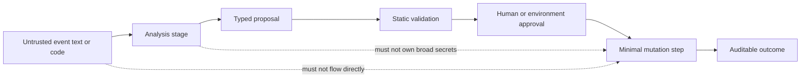

# GitHub Agentic Workflow Safety Lab

[](https://github.com/JINGJAYHUANG/github-agentic-workflow-safety-lab/actions/workflows/ci.yml)
[](https://github.com/JINGJAYHUANG/github-agentic-workflow-safety-lab/releases)
[](LICENSE)
[](pyproject.toml)

A public, executable security lab for reviewing **GitHub Actions and agentic workflows** before they receive secrets, write-capable tokens, self-hosted runners, or external tools.

The repository combines:

1. `gawsl`, a deterministic heuristic static analyzer;
2. ten vulnerable/hardened workflow pairs;
3. 22 conventional and agent-specific policy rules;
4. expiring, reviewable waivers;
5. JSON, text, and SARIF output;
6. Python 3.11–3.13 CI and release verification.

> **Status:** `v0.1.0` · policy and fixture validated · heuristic analyzer
>
> GAWSL finds review signals. It is not a sandbox, proof of safety, replacement for CodeQL, branch protection, environment approvals, or a professional penetration test.

[中文说明](docs/README.zh-CN.md) · [Threat model](docs/threat-model.md) · [Rule reference](docs/rule-reference.md) · [Lab guide](docs/lab-guide.md)

## Why this exists

Agentic workflows combine two risk surfaces:

- normal CI/CD risks such as mutable dependencies, script injection, overbroad tokens, privileged events, artifacts, and persistent runners;
- model-specific risks such as prompt injection, secret exposure, executing model output, and allowing a model to push or merge directly.

A workflow can be syntactically valid and still collapse several trust boundaries into one job. This lab makes those boundaries visible.

## Quick start

```bash
python -m pip install -e .
gawsl list-rules
gawsl verify-lab --root .
gawsl scan . --config gawsl.toml --format text
gawsl scan . --config gawsl.toml --format sarif --output gawsl.sarif
```

Scan one intentionally vulnerable fixture:

```bash
gawsl scan examples/pwn-request/vulnerable.yml \
  --root . \
  --fail-on high
```

Inspect a rule:

```bash
gawsl explain GH005
```

## Trust-boundary model



The preferred design is:

```text
untrusted input
→ read-only analysis
→ typed proposal
→ validation
→ approval boundary
→ narrowly scoped mutation
```

The dangerous design is:

```text
untrusted input
→ privileged agent
→ secrets + write token
→ shell or direct push
```

## What GAWSL detects

### GitHub Actions controls

- missing or `write-all` token permissions;
- mutable action and reusable-workflow references;
- direct event-expression interpolation in scripts;
- pull-request-target pwn-request patterns;
- self-hosted runners on untrusted pull requests;
- persisted checkout credentials in write-capable jobs;
- download-and-execute pipelines;
- privileged `workflow_run` artifact execution;
- secrets in externally triggerable privileged workflows;
- missing timeouts;
- weak OIDC boundaries;
- mutable container images;
- untrusted runner or matrix selection.

### Agent-specific controls

- unauthenticated comment commands;
- untrusted text passed directly to an agent;
- agent steps with write-capable tokens;
- model output executed as code;
- direct push, merge, or repository mutation;
- secrets passed directly to agent steps;
- missing concurrency for comment-driven agents;
- write-capable agents without a protected environment.

See [the complete rule reference](docs/rule-reference.md).

## Safe lab layout

Intentionally vulnerable examples are **not** stored under `.github/workflows`, so GitHub never treats them as active workflows:

```text
examples/
├── pwn-request/
│   ├── vulnerable.yml
│   └── hardened.yml
├── comment-agent/
│   ├── vulnerable.yml
│   └── hardened.yml
└── ... eight more pairs
```

The live workflows in `.github/workflows` are the hardened CI and release pipelines for this repository.

## Configuration

`gawsl.toml` controls discovery and the failure threshold:

```toml
[scan]
include = [
  ".github/workflows/*.yml",
  ".github/workflows/*.yaml",
  ".github/workflows/**/*.yml",
  ".github/workflows/**/*.yaml",
]
exclude = []
fail_on = "high"
waivers = "policy/waivers.json"
```

A waiver must be explicit and time-bounded:

```json
{
  "rule_id": "GH003",
  "path": ".github/workflows/legacy.yml",
  "reason": "Migration owner: platform-team; replace before next release",
  "expires_at": "2026-12-31T00:00:00Z"
}
```

Expired waivers make the scan return an operational error rather than silently suppressing findings.

## Exit codes

| Code | Meaning |
|---:|---|
| `0` | Scan completed and no active finding met the failure threshold |
| `1` | At least one active finding met the failure threshold |
| `2` | Parse error, expired waiver, invalid rule, or invalid command state |

## Repository map

```text
src/gawsl/                 Analyzer, rules, output, waiver and CLI code
examples/                  Ten vulnerable/hardened workflow pairs
policy/                    Empty public waiver ledger
schemas/                   Scan and waiver JSON Schemas
tests/                     Rule, parser, CLI, output and lab regression tests
scripts/                   Public audit, fixture guard and test-count gate
docs/                      Architecture, threat model, rules and operating guide
.github/workflows/         Hardened CI and release workflows only
```

## Security boundary

This repository contains no real credentials, private workflow logs, personal paths, private prompts, production agents, commercial records, or hidden deployment targets. All dangerous snippets are inert teaching fixtures in non-workflow directories.

Read [SECURITY.md](SECURITY.md) before reporting a vulnerability.
